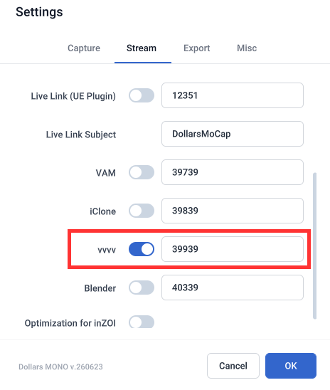

# 在 vvvv 中使用道乐师

您可以将道乐师的动捕数据实时发送到 vvvv，用来驱动角色，或搭建实时视觉、互动装置和舞台画面。

:::info 注意
道乐师的以下产品支持实时同步至 vvvv，

- Dollars MONO（自 v.250716 起）
:::

## 准备

### 道乐师产品端

在道乐师的设置中打开 vvvv 推送开关。您也可以根据需要修改使用的端口。

### vvvv 端

vvvv 端的配置和使用方法，请参考 vvvv 官方博客 [Introducing DollarsMocap](https://vvvv.org/blog/2025/introducing-dollarsmocap/)。

## 多人动捕

各个动捕角色的动作会从设置的端口开始，按编号依次向后发送。

例如端口设为默认的 39939 时，0 号角色使用 39939，1 号角色使用 39940，依此类推。

在 vvvv 端，添加多个接收端并分别监听对应的端口，即可同时驱动多个角色。
