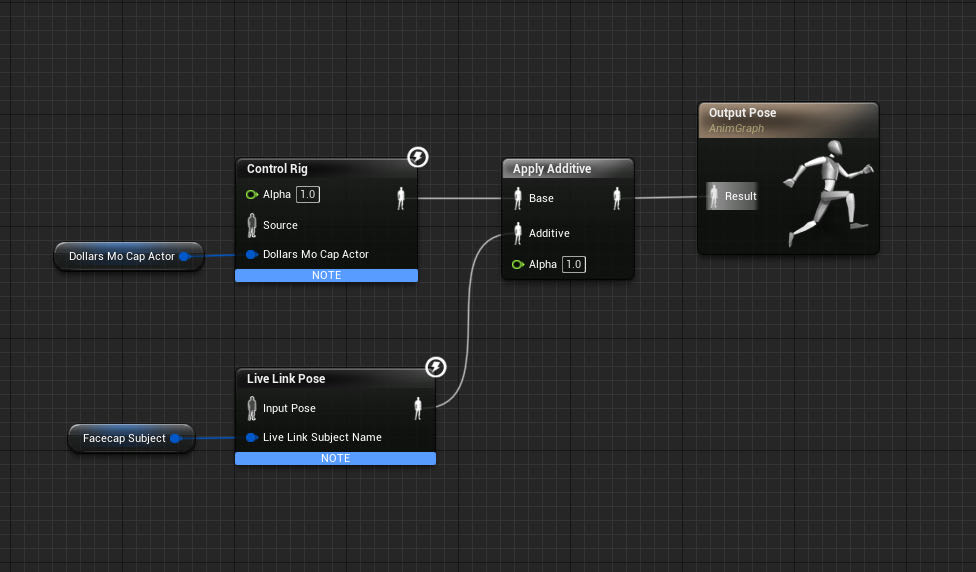

---
sidebar_position: 60
title: Unreal Engine
slug: /ue-faq
---	

# 常见问题

import TOCInline from '@theme/TOCInline';

<TOCInline toc={toc} />

## 表情和动作如何结合起来

您可以像下图中演示的，使用 Apply Additive 动画节点，将表情动画和动作动画结合起来。

您可以在几乎所有道乐师的虚幻示例中，找到表情和动作的结合的部分，建议您下载参考。下载链接请见各视频简介。

## 蓝图编译错误

建议对照视频检查蓝图是否有误，尤其建议下载视频简介中的示例项目，进行比对。

## 虚幻掉帧

当虚幻窗口处于激活状态时，有可能导致动捕掉帧，可以尝试，

- 让其他程序的窗口处于激活状态

- 限制虚幻帧率

感谢提供建议的各位网友！

## 5.X 打包错误

可以尝试以下两点：

- 将虚幻界面更改为英文

- 如果是 MetaHuman 的项目，去除动画蓝图中的 Post Process 动画蓝图

再次感谢提供建议的各位网友！

## 5.1 无法复制 Ctrl Rig

5.1 中复制 Ctrl Rig 会引起虚幻崩溃，暂时没有直接的解决方案。

可以将骨骼模型导入低版本的虚幻，生成 Ctrl Rig 之后复制到 5.1 中。

## 如何录制动作和表情

可以参照以下视频教程，12分30秒左右开始。

<iframe src="//player.bilibili.com/player.html?bvid=BV1n14y1N7QU&autoplay=0&t=757.9" width="640" height="360" scrolling="no" border="0" frameborder="no" framespacing="0" allowfullscreen="true"> </iframe>

## 切换动画蓝图后动捕失效

可以修改道乐师的动画蓝图，将 Begin Play 事件改为 Initialize Animation，如下图所示：

请注意，在运行时切换动画蓝图，可能导致角色没有动画，推荐通过在同一动画蓝图中进行状态切换来实现动捕与动作序列的转换，可以参考[这里](/ue-adv)。

