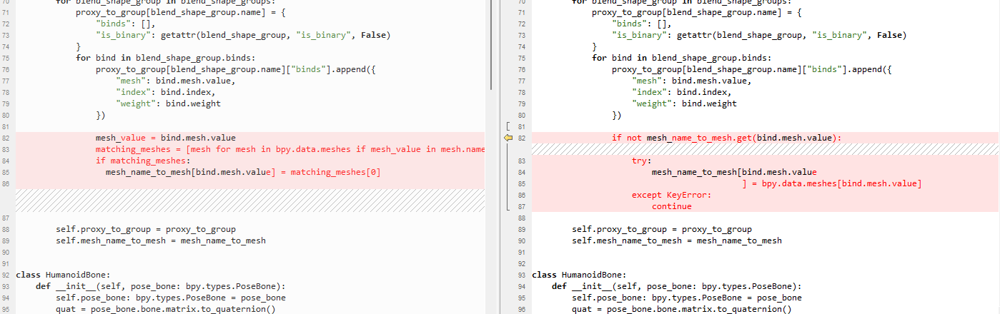
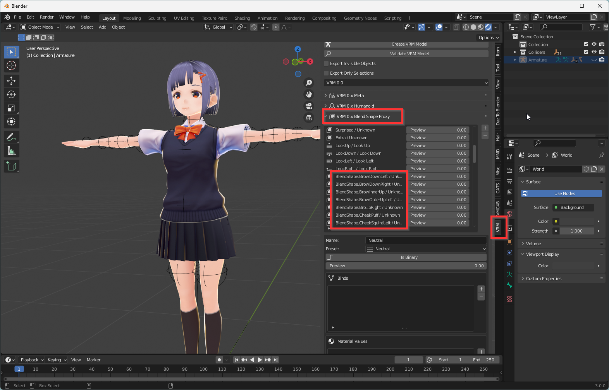
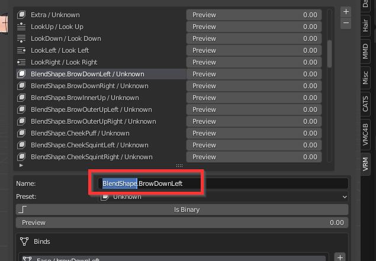
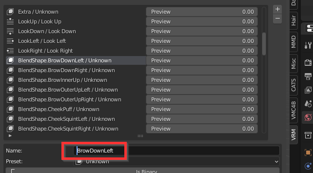

# 对 VRM 文件进行实时面部捕捉

:::info本文中使用版本
Blender 3.0.0

VRM Add-on for Blender 2.20.27，https://vrm-addon-for-blender.info/en/

VMC4B 1.1.0，https://booth.pm/en/items/3432915
:::

在 Blender 中，对 VRM 进行实时面部捕捉，除了按照上面这些插件之外，还需要修改插件文件以及确认 VRM Proxy 两个步骤。

## 修改插件

- 找到 VMC4B 所在目录。

通常在 C:\Users\<用户名>\AppData\Roaming\Blender Foundation\Blender\3.0\scripts\addons\VMC4B

- 在[这里](https://kilimanjaro.sunnyview.tech/config.py)下载 config.py，覆盖 VMC4B 目录中，core 目录下的同名文件。 

两者区别如下，左侧为修改后。

## 确认 VRM Blend Shape Proxy 名

:::info注意
您需要一个支持 Perfect Sync 的 VRM 模型，才能使用 Blend Shape Proxy 进行面部捕捉。
:::

- 导入一个 VRM 模型，打开 VRM 插件面板。在 Blend Shape Proxy 一栏中，找到面捕相关表情。

- 如有需要，将各表情的 Name 修改为以下形式。

EyeBlinkLeft  
EyeLookDownLeft  
EyeLookInLeft  
EyeLookOutLeft  
EyeLookUpLeft  
EyeSquintLeft  
EyeWideLeft  
EyeBlinkRight  
EyeLookDownRight  
EyeLookInRight  
EyeLookOutRight  
EyeLookUpRight  
EyeSquintRight  
EyeWideRight  
JawForward  
JawLeft  
JawRight  
JawOpen  
MouthClose  
MouthFunnel  
MouthPucker  
MouthLeft  
MouthRight  
MouthSmileLeft  
MouthSmileRight  
MouthFrownLeft  
MouthFrownRight  
MouthDimpleLeft  
MouthDimpleRight  
MouthStretchLeft  
MouthStretchRight  
MouthRollLower  
MouthRollUpper  
MouthShrugLower  
MouthShrugUpper  
MouthPressLeft  
MouthPressRight  
MouthLowerDownLeft  
MouthLowerDownRight  
MouthUpperUpLeft  
MouthUpperUpRight  
BrowDownLeft  
BrowDownRight  
BrowInnerUp  
BrowOuterUpLeft  
BrowOuterUpRight  
CheekPuff  
CheekSquintLeft  
CheekSquintRight  
NoseSneerLeft  
NoseSneerRight  
TongueOut  

例如，
修改前

修改后

- 全部修改后，导出 VRM。

- 载入新的 VRM，即可使用 VMC4B 进行面部捕捉。
