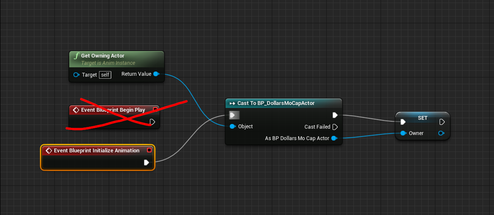

---
sidebar_position: 30
title: 📢 常见问题（完善中）
slug: /ue-faq
---	

# 常见问题

import TOCInline from '@theme/TOCInline';

<TOCInline toc={toc} />

## 蓝图编译错误

## 头发不跟随

## 虚幻掉帧

## 5 打包错误

## 5.1 无法复制 Ctrl Rig

## 如何录制动作和表情

可以参照以下视频教程，

<iframe src="//player.bilibili.com/player.html?bvid=BV1n14y1N7QU&autoplay=0&t=757.9" width="640" height="360" scrolling="no" border="0" frameborder="no" framespacing="0" allowfullscreen="true"> </iframe>

## 切换动画蓝图后动捕失效

可以修改道乐师的动画蓝图，将 Begin Play 事件改为 Initialize Animation，如下图所示：

请注意，在运行时切换动画蓝图，可能导致角色没有动画，推荐通过在同一动画蓝图中进行状态切换来实现动捕与动作序列的转换。

